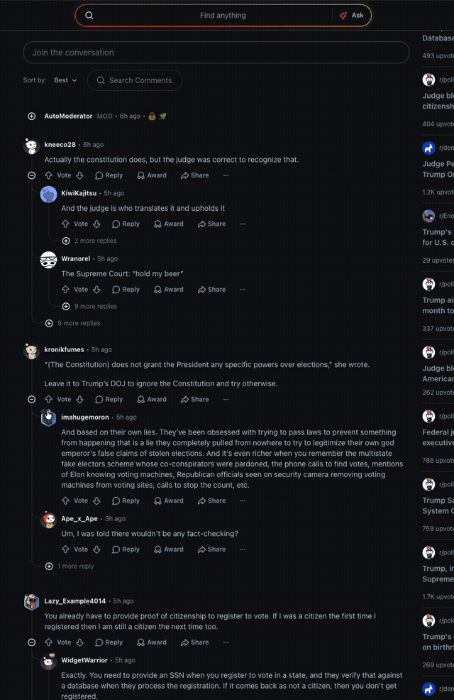

# textreflex

Paste a piece of writing and textreflex shows how it is built to move you: which emotional-manipulation strategies it uses (fear, urgency, scapegoating, polarization, tone), where they appear, whether it makes misleading claims, and what the text as a whole is really trying to do. It is a small Flask app with a single page and no database.



## Free and keyless

textreflex runs entirely on a free, no-auth AI endpoint. There are no API keys, no sign-ups, and nothing to configure — clone it, run it, use it. That is the whole point: the moment a tool like this needs you to paste in an API key, you may as well call the model yourself.

The trade-off of staying keyless is that the free endpoint rate-limits, so the app retries with a short backoff when it is busy. If a request comes back asking you to try again in a few seconds, that is the rate limit, not a bug. The provider chain is written as a list, so if another genuinely keyless endpoint becomes available it slots in as one entry.

## Running it

You need Python 3.8 or newer.

```bash
git clone https://github.com/191-iota/textreflex.git
cd textreflex
pip install -r requirements.txt
python app.py
```

The app serves on http://localhost:5000 (or `$PORT` if set). Paste text, tick the disclaimer, and analyze. A run usually takes a few seconds to half a minute.

## What you get back

For a given text the result contains:

- a per-strategy rating from none to very high, each with a short reason
- the character or sentence range where each strategy appears
- a flag for misleading or false claims, with their location
- the three most manipulative passages
- a meta analysis of the text's overall intent

It runs on the AI's judgement, so treat the output as a prompt for your own thinking rather than a verdict. Maximum input length is 5000 characters.

## Configuration

Nothing is required. A few optional environment variables exist (see `.env.example`): `AI_TIMEOUT` and `AI_RETRIES` tune how long the app waits and how hard it retries a busy endpoint, `POLLINATIONS_TOKEN` raises the free rate limits if you happen to have one, and `POLLINATIONS_MODEL` overrides the model.

## Project structure

```
textreflex/
├── app.py               # Flask backend: the keyless provider chain and /analyze
├── templates/
│   └── index.html       # single-page frontend
├── requirements.txt
├── .env.example
└── docs/                # README screenshots
```

## License

MIT.
